# Case Study 1 (Danny's Diner)

## Introduction

Danny seriously loves Japanese food so in the beginning of 2021, he decides to embark upon a risky venture and opens up a cute little restaurant that sells his 3 favourite foods: sushi, curry and ramen.

Danny’s Diner is in need of your assistance to help the restaurant stay afloat - the restaurant has captured some very basic data from their few months of operation but have no idea how to use their data to help them run the business.

## Problem Statement
Danny wants to use the data to answer a few simple questions about his customers, especially about their visiting patterns, how much money they’ve spent and also which menu items are their favourite. Having this deeper connection with his customers will help him deliver a better and more personalised experience for his loyal customers.

He plans on using these insights to help him decide whether he should expand the existing customer loyalty program - additionally he needs help to generate some basic datasets so his team can easily inspect the data without needing to use SQL.

Danny provided me with a sample of his overall customer data for me to write fully functioning SQL queries to help him answer his questions!

Danny has shared with you 3 key datasets for this case study:

sales
menu
members
You can inspect the entity relationship diagram and example data below.

## Entity Relationship diagram


## Business questions

1. What is the total amount each customer spent at the restaurant?
```
SELECT s.customer_id, SUM(price) AS Total_amount_spent
FROM sales s
INNER JOIN menu  m
ON s.product_id= m.product_id
GROUP BY s.customer_id
```
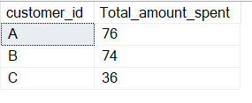


2. How many days has each customer visited the restaurant?
```
SELECT customer_id, COUNT(DISTINCT(order_date)) AS number_of_days
FROM sales
GROUP BY customer_id
```
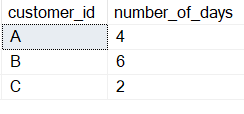


3. What was the first item from the menu purchased by each customer?
```
SELECT customer_id, product_name 
FROM (
		SELECT s.customer_id, m.product_name,
		DENSE_RANK() OVER (PARTITION BY s.customer_id ORDER BY order_date) AS first_purchase
		FROM sales s
		INNER JOIN menu m
		ON s.product_id = m.product_id) x
WHERE x.first_purchase = 1
```
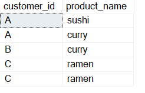


4. What is the most purchased item on the menu and how many times was it purchased?
```
SELECT customer_id, product_name, COUNT(*) AS number_of_purchase
FROM sales s
JOIN menu mu
ON s.product_id = mu.product_id
WHERE s.product_id = (
					SELECT TOP 1  product_id
					FROM sales s
					GROUP BY product_id
					ORDER BY  COUNT(*) DESC)
GROUP BY customer_id, product_name
```
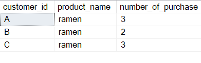


5. Which item was the most popular for each customer?
```
SELECT customer_id, product_name
FROM (
		SELECT customer_id, s.product_id, product_name, COUNT(*) AS  count_of_items, 
		RANK() OVER(PARTITION BY customer_id ORDER BY COUNT(*) DESC)AS rnk
		FROM sales s
		JOIN menu mu
		ON s.product_id = mu.product_id
		GROUP BY customer_id, s.product_id, product_name) x
WHERE x.rnk = 1
```
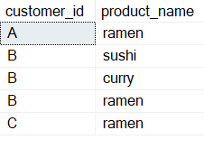


6. Which item was purchased first by the customer after they became a member?
```
WITH first_purchase AS 
(
	SELECT s.customer_id, s.product_id, product_name, order_date, 
	RANK() OVER(PARTITION BY s.customer_id ORDER BY order_date) first_purchase_after_becoming_member
	FROM sales s
	JOIN menu mu 
	ON s.product_id = mu.product_id
	JOIN members m
	ON s.customer_id = m.customer_id
	WHERE order_date > join_date )

SELECT customer_id, product_name
FROM first_purchase
WHERE first_purchase_after_becoming_member = 1
```
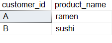


7. Which item was purchased just before the customer became a member?
```
WITH last_purchase AS
(
	SELECT s.customer_id, product_name, order_date, join_date,
	DENSE_RANK() OVER(PARTITION BY s.customer_id ORDER BY order_date DESC) AS last_purchase
	FROM sales s
	JOIN menu mu 
	ON s.product_id = mu.product_id
	JOIN members m
    ON s.customer_id = m.customer_id
	WHERE order_date < join_date)

SELECT customer_id, product_name
FROM last_purchase
WHERE last_purchase = 1
```
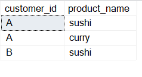


8. What is the total items and amount spent for each member before they became a member?
```
SELECT s.customer_id, COUNT(*) AS total_items_bought, SUM(price) AS total_price
FROM sales s
JOIN menu mu
ON s.product_id = mu.product_id
JOIN members m
ON s.customer_id = m.customer_id
WHERE order_date < join_date
GROUP BY s.customer_id
```
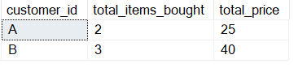


9. If each $1 spent equates to 10 points and sushi has a 2x points multiplier - how many points would each customer have?
```
SELECT customer_id,
	SUM(CASE 
			WHEN product_name <> 'sushi' THEN price * 10
			ELSE price  * 20
			END ) AS total_points
FROM sales s 
JOIN menu mu 
ON s.product_id = mu.product_id
GROUP BY customer_id
```
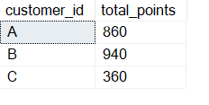


10. In the first week after a customer joins the program (including their join date) they earn 2x points on all items, not just sushi - how many points do customer A and B have at the end of January?
```
SELECT s.customer_id, 
	   SUM(CASE 
			    WHEN mu.product_id = 1 THEN (price * 20)
				WHEN mu.product_id <> 1 AND (order_date between m.join_date AND 
				DATEADD(DAY, 6, join_date)) THEN (price * 20)
				ELSE (price *10) END )
				AS points
FROM sales s
JOIN members m
ON s.customer_id = m.customer_id
JOIN menu mu
ON s.product_id = mu.product_id
WHERE s.order_date <= '2021-01-31'
GROUP BY s.customer_id
```
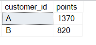


- Bonus question.
```
SELECT s.customer_id, order_date, mu.product_name, price, 
		CASE 
			 WHEN order_date < join_date THEN 'N'
	         WHEN order_date >= join_date THEN 'Y' 
			 ELSE 'N' END AS member
FROM sales s
LEFT JOIN members m
ON s.customer_id = m.customer_id
JOIN menu mu 
ON s.product_id = mu.product_id
```
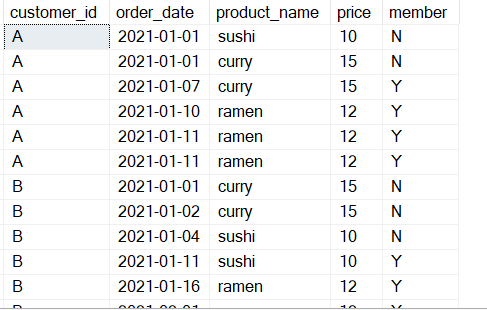


Bonus question.
```
 WITH ranking AS
 (
 SELECT s.customer_id, order_date, product_name, price, 
		CASE 
			 WHEN order_date < join_date THEN 'N'
	         WHEN order_date >= join_date THEN 'Y' 
			 ELSE 'N' END AS member
FROM sales s
JOIN menu mu 
ON s.product_id = mu.product_id
LEFT JOIN members m
ON s.customer_id = m.customer_id)

SELECT *,
	CASE
		WHEN member = 'N' THEN null
		ELSE DENSE_RANK() OVER( PARTITION BY customer_id, member ORDER BY order_date)
		END AS ranking
FROM ranking
```
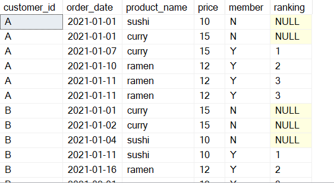


